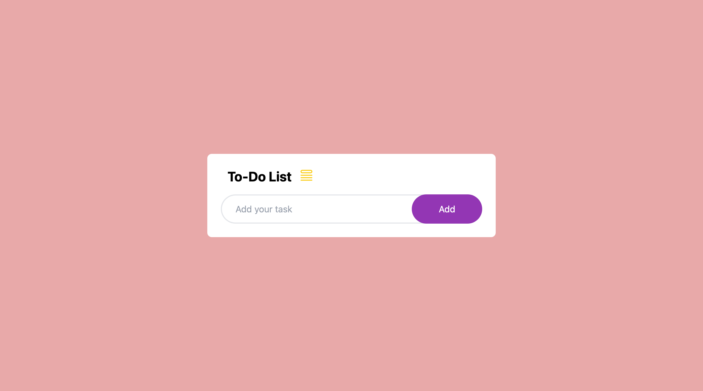
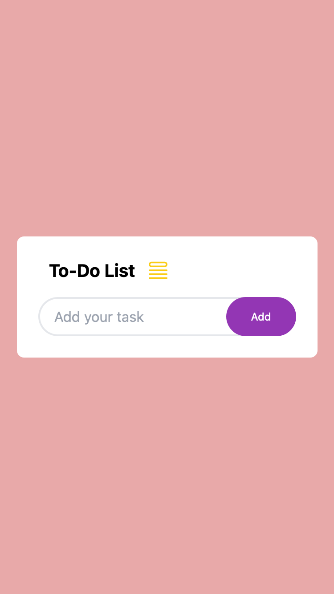
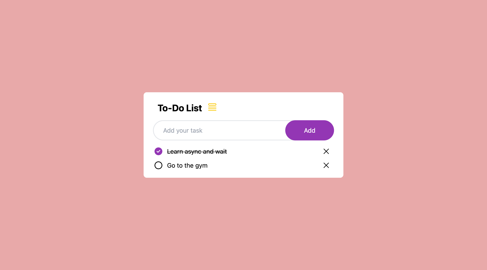
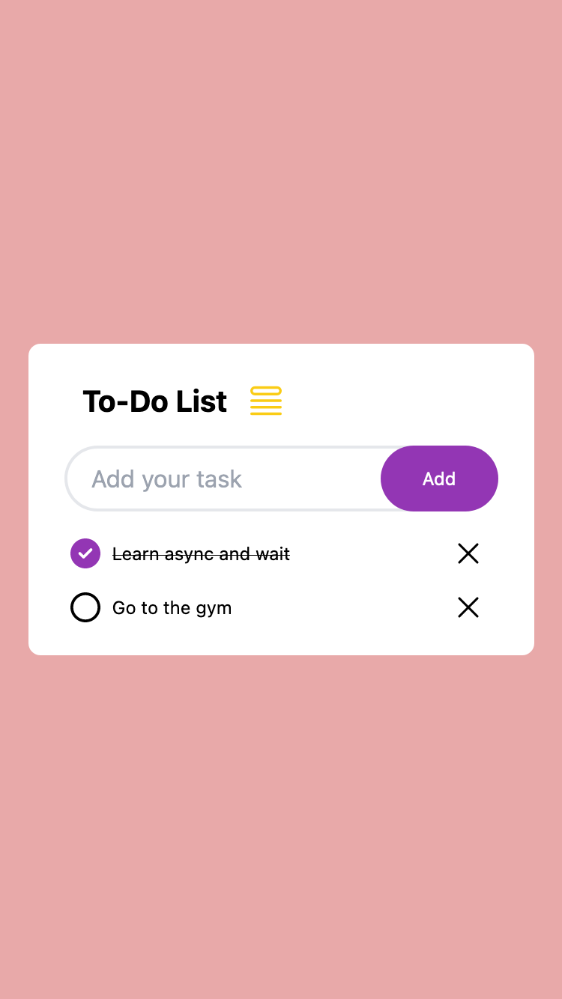

# To-Do List App

[Live URL]()

## About The Project

A simple and responsive to-do list app that allows you to manage your tasks and stay organized. The app is designed to work seamlessly on both mobile and desktop devices, providing a smooth user experience.

 

Users should be able to:

- Add tasks: Easily add new tasks to your to-do list.
- Mark tasks as complete: Check off completed tasks to keep track of your progress.
- Delete tasks: Remove tasks that are no longer needed.
- Responsive design: The app adjusts its layout and functionality based on the screen size, providing an optimal experience on mobile, tablet, and desktop devices.

 

## Usage

1. Type a task in the input field and press Enter or click the "Add" button to add it to the list.
1. Click the checkbox next to a task to mark it as complete.
1. Click the "X" button next to a task to delete it from the list.

 

## Screenshot

|  |  |
| -------------------------------------------- | ------------------------------------------- |

|  |  |
| ---------------------------------------- | --------------------------------------- |

 

## Built With

- HTML
- Mobile-first workflow
- CSS Flexbox
- Javascript
- DOM manipulation
- Tailwindcss

 

## Acknowledgement

I got the Idea and design from this youtube channel [Easy tutorials](https://www.youtube.com/watch?v=G0jO8kUrg-I)

## Useful Resources

#### - [Tailwind css](https://tailwindcss.com/) - The official tailwind css documentation.

#### - [ChatGPT](https://chat.openai.com/) - For best practices, approach, refactoring and daily life comparison and explanation
